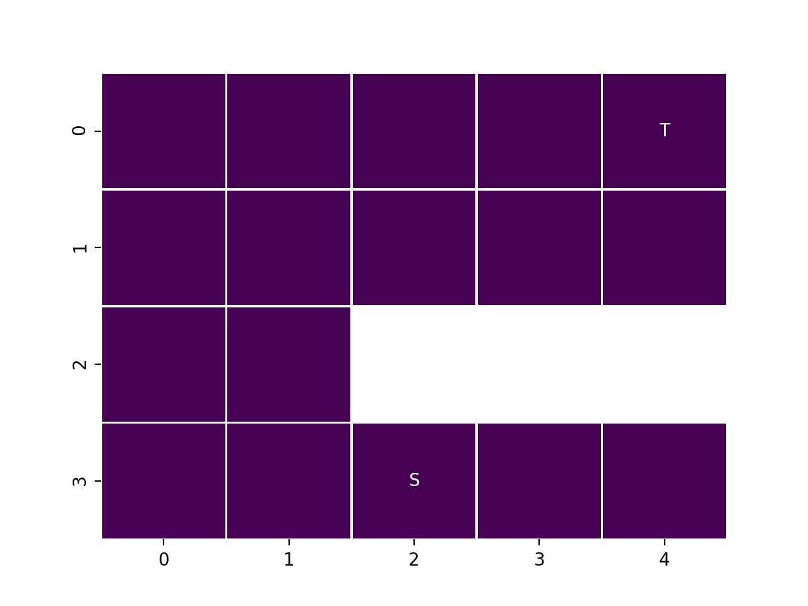
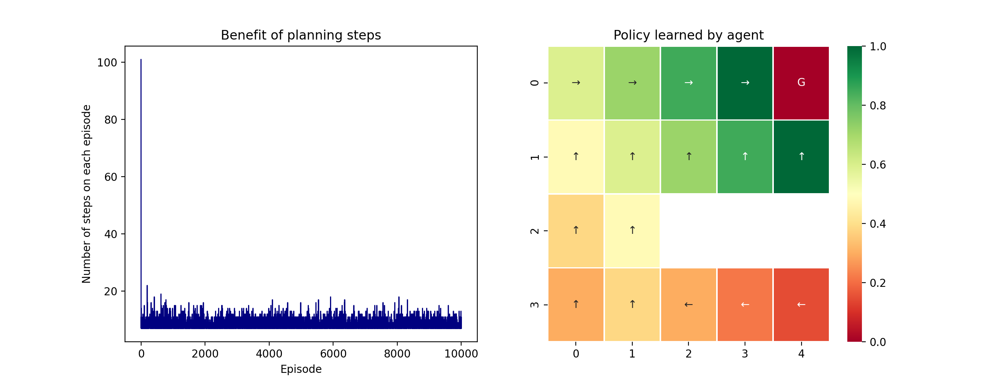

## Reinforcement Learning: GridWorld with DynaQ

This repository focuses on training an agent to find its way in the following GridWorld:




In order to accomplish this task, I applied DynaQ algorithm, which is an improvement over Q-Learning, since in the end of each episode of the interaction between agent and environment some simulated steps are taken using a model learned by the agent. Hence, it keeps updating further the agent's action values without any need to interact with the environment. It helps speeding up training time, especially when we look at the number of steps taken on each episode as we progress in the training process.

The final results are shown below:




#### DynaQ

For each episode:

1. Initialize _Q(s,a)_ and _model(s,a)_ for all _s_ and _a_
2. S <- current nonterminal state
3. Take an action A using ε-Greedy
4. Take action A and observe next-state S' + reward R
5. **Q-Learning**: _Q(S,A) <- Q(S,A) + α(R + γmax<sub>a</sub>Q(S',a) - Q(S,A))_
6. Update _model_: _model(S,A) <- R, S' (assuming deterministic environment)
7. **Planning**:

    (a) S <- random previously observed state  
    (b) A <- random action previously taken in S  
    (c) S', R <- model(S,A)  
    (d) _Q(S,A) <- Q(S,A) + α(R + γmax<sub>a</sub>Q(S',a) - Q(S,A))_

_______


For the training and prediction pipelines, the following command must be executed in a terminal:


```
python main.py [--episodes INT] [--planning_steps INT]
```